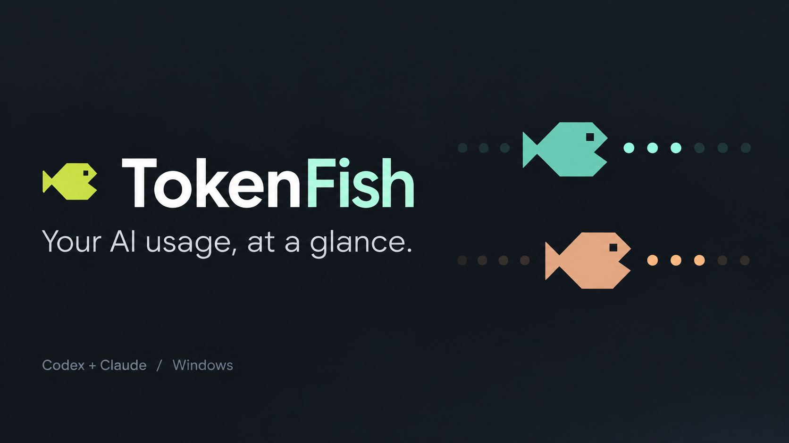
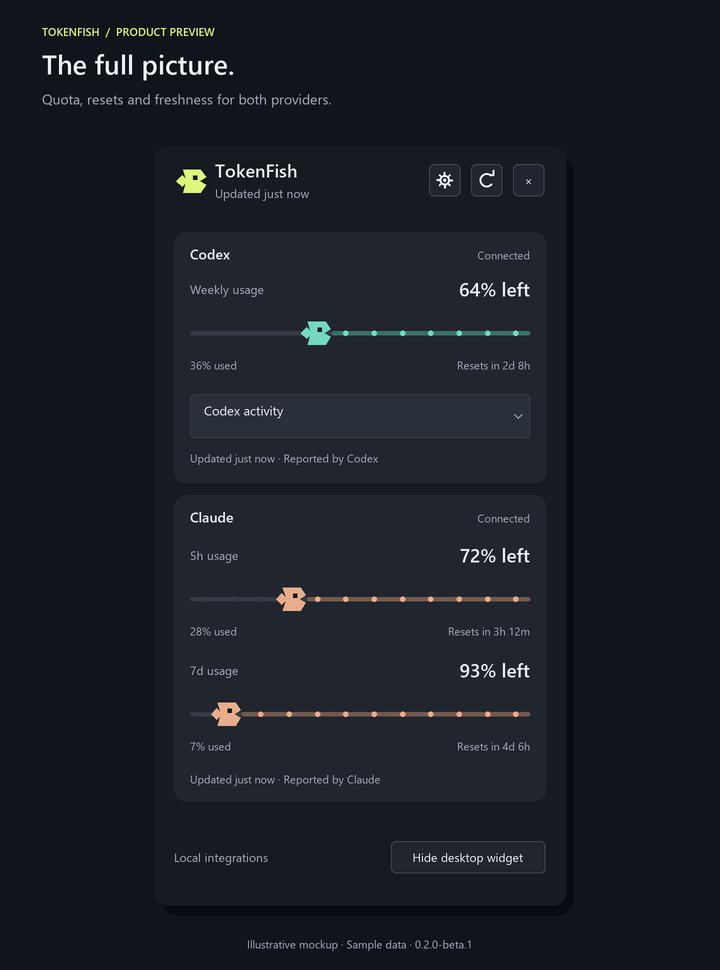
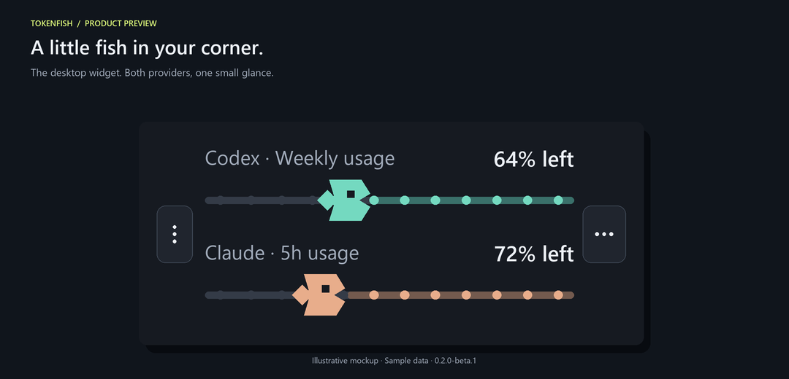
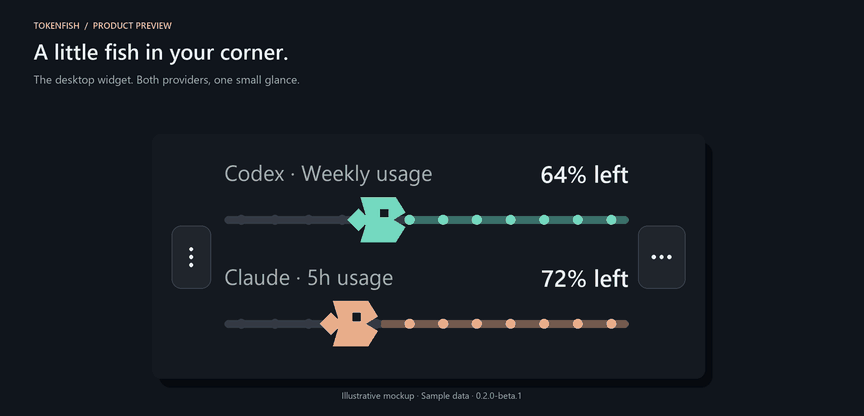
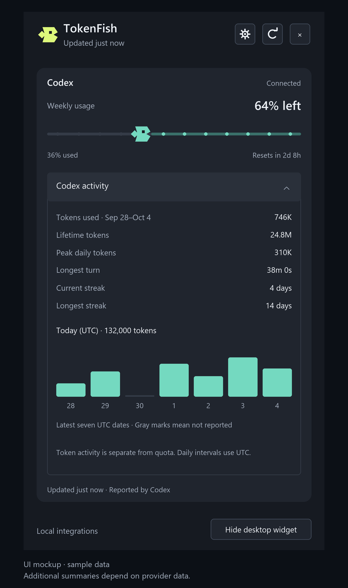
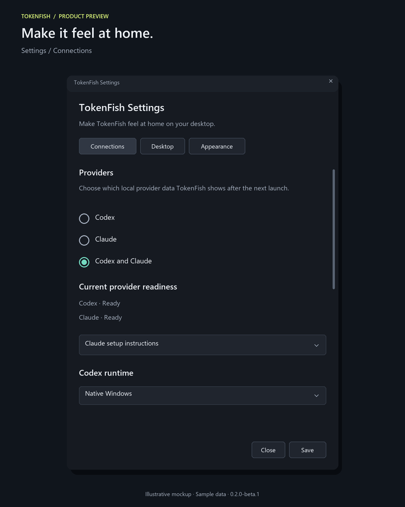
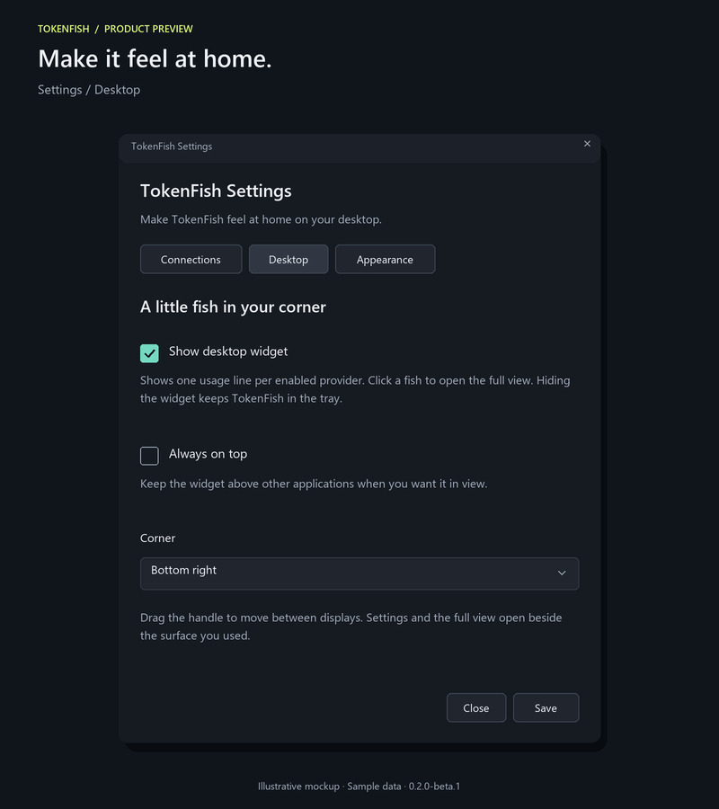
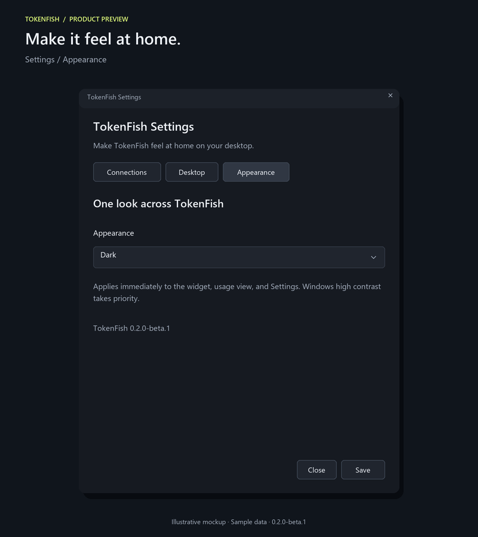

# TokenFish



**A little fish for your AI limits.** TokenFish is a Windows tray companion for Codex and Claude Code. See how much quota is left, when it resets, and whether the reading is fresh. Keep a tiny widget in your desktop corner, or open the full view when you want more detail.

The fish chomp token pellets while their positions follow consumed quota. Mint is Codex; peach is Claude. Motion respects Windows' animation preference and pauses when a view is hidden.

[Get a build](https://github.com/pixelsncodes/tokenfish/actions/workflows/windows-portable.yml) · [Releases](https://github.com/pixelsncodes/tokenfish/releases) · [How it works](docs/architecture/how-it-works.md) · [Development story](docs/development.md) · [Report an issue](https://github.com/pixelsncodes/tokenfish/issues)

## At a glance

| Feature | What you get |
| --- | --- |
| Two providers | Codex, Claude, or both; independent quota windows and freshness |
| Full view | Remaining percentages, consumed quota, reset countdowns and exact reset tooltips |
| Desktop widget | One usage line per provider, saved corner/monitor, optional always-on-top, hide/restore |
| Activity | Codex token totals and seven UTC dates; additional summaries only when the provider reports them |
| Appearance | System, Light, and Dark across the app; Windows high contrast takes priority |
| Local data | No TokenFish account, backend, telemetry, or credential store |

## Meet the fish

These are illustrative mockups of the current beta using **sample data**, not account screenshots. The GIF reproduces the native mouth animation; the usage values stay fixed in the demo.

<table>
  <tr>
    <td width="42%" valign="top">
      <strong>Full view</strong><br><br>
      
    </td>
    <td width="58%" valign="top">
      <strong>Desktop widget</strong><br><br>
      
      <br><br><strong>Chomp, chomp.</strong><br><br>
      
      <br><br>Click usage to open the full view. Drag the grip to move the widget. Its menu opens Settings or hides it.
    </td>
  </tr>
</table>

### Codex activity

Expand **Codex activity** for token totals and a chart of the latest seven UTC dates. Lifetime tokens, peak daily tokens, streaks, and longest turn appear only when the installed provider reports them. Gray chart marks mean **not reported**, rather than zero; token activity is separate from remaining quota.

<a href="docs/media/codex-activity.png"></a>

[See the activity view beside the desktop widget](docs/media/codex-activity-desktop.png). These previews use a Codex-only configuration and synthetic sample data.

<details>
  <summary><strong>Settings: Connections, Desktop, and Appearance</strong></summary>

Choose your provider/runtime, place the widget, and change the theme. Settings opens beside the surface that invoked it.

| Connections | Desktop | Appearance |
| --- | --- | --- |
|  |  |  |

[View full-size images and asset notes](docs/media/README.md).

</details>

## Portable beta

The current candidate is **0.2.0-beta.1**, for Windows x64. A public GitHub release has not been published yet. The portable package includes the .NET and Windows App SDK runtimes; users do not need the development SDK.

For a development build, open [Windows portable candidate](https://github.com/pixelsncodes/tokenfish/actions/workflows/windows-portable.yml), choose a successful run for `main`, and download its **TokenFish-win-x64** artifact. GitHub requires sign-in to download workflow artifacts. Extract the artifact archive, then extract the versioned application ZIP inside it. These artifacts expire after 14 days; durable downloads will be listed in [Releases](https://github.com/pixelsncodes/tokenfish/releases) when published.

1. Download the versioned `win-x64.zip` from Releases when available and extract the **whole folder** to a permanent location.
2. Run `TokenFish.App.exe`. First-run setup lets you select Codex, Claude, or both.
3. Click the tray icon for your quota and reset countdown. Open Settings to enable the desktop widget or choose System, Light, or Dark appearance.

Windows 11 x64 is the beta target. Clean-machine testing is still pending. This is an unsigned portable build; there is no installer, automatic update, or startup registration. Do not run as administrator. Keep the bundled files together. To update, exit through the tray menu before replacing the application folder.

## Desktop widget

Enable it in **Settings → Desktop** or with **Show desktop widget** in the full view. It displays one quota window per selected provider, a fish, and the remaining percentage. Click its usage area to open the full view. The options menu opens Settings or hides the widget. Drag its grip to another corner or monitor; it snaps to the nearest corner and remembers the position. Arrow keys on the grip change corners. Always-on-top is optional and disabled by default.

Settings opens beside the widget or full view that invoked it, inside the monitor's usable area. Appearance and desktop options apply immediately. Connection changes saved in Settings apply after restarting. Setup's back/edit/recheck path reconnects using the edited configuration immediately.

## Connect Codex

Install and sign in to the Codex CLI separately. Choose the runtime matching that installation: **Native Windows**, **WSL login shell**, or **WSL direct**. For WSL, leave the distribution field empty to use the default distribution, or enter its name. TokenFish uses the local Codex App Server and reconnects on a later refresh after a failed session. Requests have bounded deadlines.

Quota and token activity are independent. An unsupported or temporarily unavailable activity request does not hide usable quota. Activity details show the latest seven UTC dates, with missing dates marked as not reported. Lifetime tokens, peak daily usage, streaks, and longest-running turn appear only when the installed provider supplies them. Token activity is not a measure of remaining messages, subscription value, or every ChatGPT website feature.

## Connect Claude

The included `tools\claude\TokenFish.ClaudeBridge.exe` reads Claude Code's status-line input and stores allowlisted quota observations locally. In **Settings → Connections**, copy the Windows or WSL snippet matching where Claude Code runs, and apply it manually to Claude Code's settings. TokenFish never edits those settings automatically. Start a Claude Code session so it can report data. Both five-hour and weekly quotas are shown when supplied.

See [the bridge guide](docs/architecture/claude-status-line-bridge.md) for setup and data details. If you move the portable folder, generate a new snippet and update the configured bridge path.

## Privacy and troubleshooting

TokenFish has no backend, telemetry, or credential store. Authentication stays with the provider's own runtime. Settings and normalized Claude observations live under `%LOCALAPPDATA%\TokenFish`; the download does not include personal settings or observations. See [privacy and security](docs/architecture/privacy-and-security.md).

- **No quota:** check the selected runtime and sign-in, then refresh. Claude needs a status-line observation from a running Claude Code session.
- **Stale:** the last successful reading remains visible; its observation time is shown. A refresh attempt alone does not make it fresh.
- **Widget hidden:** restore it through the full view or Settings. Closing the full view keeps TokenFish in the tray; use the tray's Exit command to quit.
- **Connection changes:** restart after saving them in Settings.

## How it works

TokenFish reads data from your existing local tools. The Codex adapter talks to the locally installed Codex App Server through redirected standard input/output. The Claude bridge accepts Claude Code status-line input and saves only allowlisted quota observations. A shared refresh lifecycle normalizes provider data, retains the last successful reading when needed, and feeds both desktop views.

Quota is provider-reported consumption, not a calculation from the animated pellets. The fish's position represents **percent used**; the label emphasizes **percent left**. Token activity is separate from quota. TokenFish does not measure every ChatGPT website limit, infer remaining message counts, or track API billing.

See [how it works](docs/architecture/how-it-works.md) for the data flow, timeouts, freshness rules, and local storage boundaries.

## How it was developed

TokenFish is built in **C# with .NET 10, WinUI 3, and the Windows App SDK**. The solution separates the desktop shell, normalized models, infrastructure, and provider adapters. It was developed iteratively with Codex assistance, with the owner steering the feature set and design: retain both providers, keep the little fish, remove the native white rim, add an optional compact widget, and place Settings beside the invoking view.

The beta has **825 passing tests** across Core, Infrastructure, Codex, and Claude. The test suite checks parsing, quota semantics, freshness, setup flows, timeout/recovery behavior, layout, settings compatibility, and animation eligibility. Visual checks supplement those tests; clean-machine and broader accessibility/display validation remain release gates. [Read the development story and contributing guide](docs/development.md).

## Build, test, and package

Use Windows x64 and the .NET SDK selected by `global.json`.

```powershell
dotnet build TokenFish.sln -p:Platform=x64
dotnet test TokenFish.sln -p:Platform=x64
pwsh -NoProfile -File scripts/package-portable.ps1
```

The packaging script builds, tests, publishes to a new directory, rejects common personal/debug artifacts, creates a ZIP, checks its contents, and writes SHA-256 checksums. GitHub Actions performs the same steps and uploads downloadable build artifacts; it does not publish a release automatically. Action configuration follows the official [checkout](https://github.com/actions/checkout), [setup-dotnet](https://github.com/actions/setup-dotnet), and [upload-artifact](https://github.com/actions/upload-artifact) documentation.

For an isolated development UI check, set `TOKENFISH_SETTINGS_PATH` to an absolute test settings file. This overrides only app settings, not provider authentication or Claude observations. `--show` opens the full view after startup; `--settings` opens Settings; `--inspect-windows` makes borderless surfaces discoverable in task switching and desktop inspection tools. Never distribute test settings.

## Release status

See [current status](docs/current-status.md) and [release validation](docs/releases/0.2.0-beta.1.md). Before publishing publicly, choose the project license and complete the listed desktop/clean-machine checks. A stable installer, final icon artwork, signing, ARM64 validation, notifications, and automatic updates remain separate follow-up work.
