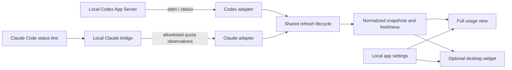

# How TokenFish works

TokenFish turns provider-reported limits into a small Windows usage view. It uses the local tools you already sign in to and has no TokenFish server or account system.

## Data flow

The full view and widget share the same collected data. Enabling the widget does not create a second provider polling loop. Their UI updates include reset countdowns and age labels without treating a repaint as a new provider observation.

## Codex

The Codex adapter starts the installed Codex App Server as a local child process and communicates through redirected standard input/output. Runtime selection supports native Windows, a WSL login shell, or direct WSL invocation. Authentication remains with Codex.

Account quota and optional token activity are collected separately. Quota remains usable if an optional activity request fails or the installed runtime does not support it. The beta applies a 15-second startup deadline, a 20-second collection deadline, and a 5-second optional activity deadline. Failed sessions are discarded so a later refresh can reconnect.

Quota group names are preserved when reported. Available token activity can include dated daily totals, lifetime usage, peak daily usage, streaks, and the longest-running turn. These fields appear only when the provider supplies them. Missing daily dates are marked as not reported; they are not silently converted into zero-use days. Daily chart dates use UTC.

This data reflects the installed Codex runtime's reports. TokenFish is not a universal tracker of ChatGPT website features, message limits, or API spend. See [Codex usage semantics](codex-usage-semantics.md).

## Claude

Claude Code invokes the included bridge executable through its status-line configuration. The bridge accepts status-line input and writes a normalized local observation containing allowlisted five-hour and seven-day quota fields when present. The Claude adapter reads that observation.

Setup is manual: copy the matching Windows or WSL snippet from Settings into Claude Code's configuration, then start a Claude Code session. TokenFish does not edit that configuration or inspect Claude credentials. Because the bridge observes an active session, opening TokenFish or clicking Refresh cannot manufacture a fresh Claude reading.

See [Claude bridge setup and schema](claude-status-line-bridge.md).

## Quota, fish, and freshness

- **Fish position:** consumed percentage, clamped to the rail. The percentage label shows the remainder.
- **Pellets:** a visual quota metaphor, not individual tokens or messages.
- **Mouth motion:** alternating open/closed fish geometry every 170 milliseconds, completing a 340-millisecond loop. It stops when hidden/unloaded or when Windows animations are disabled.
- **Reset countdown:** derived from a reported reset time. The full view also exposes the exact reset time in a tooltip.
- **Freshness:** comes from the last successful source observation. Old readings remain visibly stale; refreshing or repainting alone does not renew them.
- **Activity:** token totals are a separate measure and are not subtracted from account quota.

## Desktop behavior

The tray keeps the app available after the full view is hidden. The optional widget shows the first reported quota window for each selected provider. It can snap to a corner, remember its monitor anchor, and optionally stay above other apps. Settings and the full view open beside the surface used to invoke them, clamped to a monitor's usable area.

System, Light, and Dark appearance apply immediately. Windows high contrast overrides custom colors. Changes to provider connections saved in Settings require an application restart; onboarding's edit/reverify flow replaces its runtime immediately.

## Local storage and privacy

Settings and normalized Claude observations live under `%LOCALAPPDATA%\TokenFish`. Claude quota state is stored at `bridge\claude-status-v1.json`. TokenFish does not persist raw status-line payloads, prompts, responses, transcripts, source code, browser history, cookies, or provider authentication. There is no telemetry, remote TokenFish backend, or public listening port.

The portable download contains application/runtime files and the bridge, not personal settings or observations. Provider tools can have their own network behavior and authentication; TokenFish's UI reads their local reports. See [privacy and security](privacy-and-security.md).
